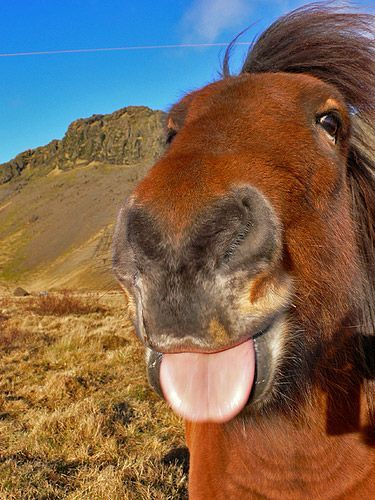

# 🐴 你好 / Hi, I'm Bruce

**马年本命年限定版 / Year of the Horse vibe** ✨  
CS @ USC • Builder mindset • Keep it simple & fun

---

## 🙋‍♂️ 关于我 / About Me
- 我喜欢把想法做成能用的东西（从 0 到 1）  
  I like turning ideas into real, usable stuff.
- 兴趣方向：AI Vision / Backend / Product  
  Interests: AI Vision / backend / product building.
---

## 🧩 我在这里会放什么 / What you’ll see here
- 练手的小项目 / small experiments
- 学习笔记 / notes
- 一些工具和脚本 / tools & scripts
- （以及偶尔的抽象整活）/ (and some occasional memes :D)

---

## 🧰 技能徽章 / Tech Badges

---

## 📫 联系 / Contact
- Website / 个人主页: https://brucelzx.github.io/
- Email: bruceli@ucla.edu

---

**Thanks for visiting / 感谢来访** 🤝  
🐴🐴🐴

